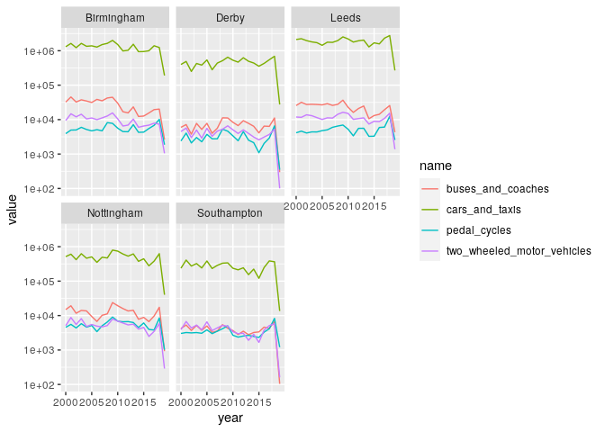
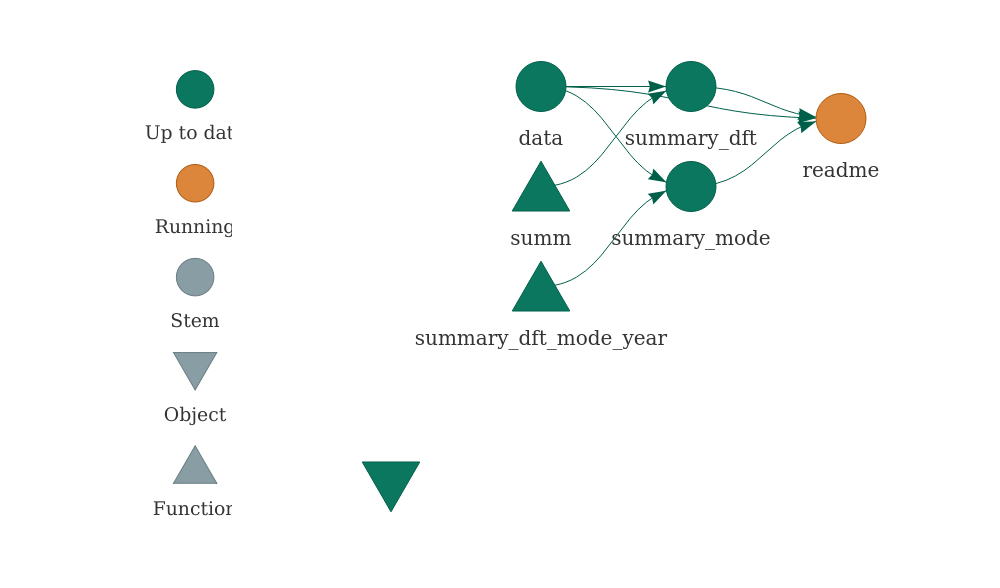

<!-- README.md is generated from README.Rmd. Please edit that file -->

# dftTrafficCounts

<!-- badges: start -->

[](https://github.com/itsleeds/dftTrafficCounts/actions)
<!-- badges: end -->

The goal of dftTrafficCounts is to provide easy access to datasets
provided by UK Department for Transport (DfT) on their
[roadtraffic.dft.gov.uk](https://roadtraffic.dft.gov.uk) website. See
the
[Metadata](http://data.dft.gov.uk.s3.amazonaws.com/road-traffic/all-traffic-data-metadata.pdf)
document for details.

## Installation

<!-- You can install the released version of dftTrafficCounts from [CRAN](https://CRAN.R-project.org) with: -->

<!-- ``` r -->

<!-- install.packages("dftTrafficCounts") -->

<!-- ``` -->

<!-- And the development version from [GitHub](https://github.com/) with: -->

``` r
# install.packages("devtools")
devtools::install_github("itsleeds/dftTrafficCounts")
```

<!-- From previous readme... -->

<!-- If you have traffic count data you would like to contribute to the Bristol City Council open data platform please contact city.transport@bristol.gov.uk -->

<!-- The entire dataset and a shapefile of the count locations can be downloaded here: http://1drv.ms/1LaIsZ4 -->

<!-- This data has not been quality checked and we strongly advise users conduct their own assessment of the quality of the data before using it. -->

Load the package as follows:

``` r
library(dftTrafficCounts)
```

# Getting traffic count data

You can read-in the data for a single counter point as follows:

``` r
d_counter = dtc_import()
#> Rows: 20
#> Columns: 31
#> Delimiter: ","
#> chr [ 8]: region_name, local_authority_name, road_name, road_type, start_junction_road_nam...
#> dbl [23]: count_point_id, year, region_id, local_authority_id, easting, northing, latitude...
#> 
#> Use `spec()` to retrieve the guessed column specification
#> Pass a specification to the `col_types` argument to quiet this message
names(d_counter)
#>  [1] "count_point_id"               "year"                        
#>  [3] "region_id"                    "region_name"                 
#>  [5] "local_authority_id"           "local_authority_name"        
#>  [7] "road_name"                    "road_type"                   
#>  [9] "start_junction_road_name"     "end_junction_road_name"      
#> [11] "easting"                      "northing"                    
#> [13] "latitude"                     "longitude"                   
#> [15] "link_length_km"               "link_length_miles"           
#> [17] "estimation_method"            "estimation_method_detailed"  
#> [19] "pedal_cycles"                 "two_wheeled_motor_vehicles"  
#> [21] "cars_and_taxis"               "buses_and_coaches"           
#> [23] "lgvs"                         "hgvs_2_rigid_axle"           
#> [25] "hgvs_3_rigid_axle"            "hgvs_3_or_4_articulated_axle"
#> [27] "hgvs_4_or_more_rigid_axle"    "hgvs_5_articulated_axle"     
#> [29] "hgvs_6_articulated_axle"      "all_hgvs"                    
#> [31] "all_motor_vehicles"
head(d_counter)
#> # A tibble: 6 x 31
#>   count_point_id  year region_id region_name local_authority… local_authority…
#>            <dbl> <dbl>     <dbl> <chr>                  <dbl> <chr>           
#> 1          74816  2019         8 Yorkshire …               63 Leeds           
#> 2          74816  2018         8 Yorkshire …               63 Leeds           
#> 3          74816  2017         8 Yorkshire …               63 Leeds           
#> 4          74816  2016         8 Yorkshire …               63 Leeds           
#> 5          74816  2015         8 Yorkshire …               63 Leeds           
#> 6          74816  2014         8 Yorkshire …               63 Leeds           
#> # … with 25 more variables: road_name <chr>, road_type <chr>,
#> #   start_junction_road_name <chr>, end_junction_road_name <chr>,
#> #   easting <dbl>, northing <dbl>, latitude <dbl>, longitude <dbl>,
#> #   link_length_km <dbl>, link_length_miles <dbl>, estimation_method <chr>,
#> #   estimation_method_detailed <chr>, pedal_cycles <dbl>,
#> #   two_wheeled_motor_vehicles <dbl>, cars_and_taxis <dbl>,
#> #   buses_and_coaches <dbl>, lgvs <dbl>, hgvs_2_rigid_axle <dbl>,
#> #   hgvs_3_rigid_axle <dbl>, hgvs_3_or_4_articulated_axle <dbl>,
#> #   hgvs_4_or_more_rigid_axle <dbl>, hgvs_5_articulated_axle <dbl>,
#> #   hgvs_6_articulated_axle <dbl>, all_hgvs <dbl>, all_motor_vehicles <dbl>
```

Read-in the data for major roads as follows:

``` r
d_roads = dtc_import_roads()
names(d_roads)
```

Read-in data for all local authorities as follows:

``` r
d_las = dtc_import_la()
#> Rows: 5,529
#> Columns: 6
#> Delimiter: ","
#> dbl [6]: local_authority_id, year, link_length_km, link_length_miles, cars_and_taxis, al...
#> 
#> Use `spec()` to retrieve the guessed column specification
#> Pass a specification to the `col_types` argument to quiet this message
head(d_las)
#> # A tibble: 6 x 7
#>   local_authority…  year link_length_km link_length_mil… cars_and_taxis
#>              <dbl> <dbl>          <dbl>            <dbl>          <dbl>
#> 1              132  1993           385.             239.     287107347.
#> 2              170  1993           493.             306.     604140896.
#> 3              171  1993           675.             420.     446328949.
#> 4              163  1993           846.             526.     668148078.
#> 5              164  1993           524.             326.     343540976.
#> 6              156  1993           542.             337.     409189896 
#> # … with 2 more variables: all_motor_vehicles <dbl>, local_authority_name <chr>
nrow(d_las)
#> [1] 5529
length(unique(d_las$local_authority_id))
#> [1] 210
```

``` r
u = "http://data.dft.gov.uk/road-traffic/dft_traffic_counts_raw_counts.zip"
d = dtc_import(u = u)
```

This is a large dataset covering all local authorities in Great Britain:

``` r
nrow(d)
#> [1] 4337901
ncol(d)
#> [1] 34
names(d)
#>  [1] "count_point_id"               "direction_of_travel"         
#>  [3] "year"                         "count_date"                  
#>  [5] "hour"                         "region_id"                   
#>  [7] "local_authority_id"           "road_name"                   
#>  [9] "road_category"                "road_type"                   
#> [11] "start_junction_road_name"     "end_junction_road_name"      
#> [13] "easting"                      "northing"                    
#> [15] "latitude"                     "longitude"                   
#> [17] "link_length_km"               "link_length_miles"           
#> [19] "sequence"                     "ramp"                        
#> [21] "pedal_cycles"                 "two_wheeled_motor_vehicles"  
#> [23] "cars_and_taxis"               "buses_and_coaches"           
#> [25] "lgvs"                         "hgvs_2_rigid_axle"           
#> [27] "hgvs_3_rigid_axle"            "hgvs_4_or_more_rigid_axle"   
#> [29] "hgvs_3_or_4_articulated_axle" "hgvs_5_articulated_axle"     
#> [31] "hgvs_6_articulated_axle"      "all_hgvs"                    
#> [33] "all_motor_vehicles"           "local_authority_name"
head(d$local_authority_name)
#> [1] "Lancashire" "Lancashire" "Lancashire" "Lancashire" "Lancashire"
#> [6] "Lancashire"
```

We can look at how patterns change over time for the whole dataset:

``` r
# could become package function
library(ggplot2)
tar_read(summary_mode) %>% 
  ggplot() +
  geom_line(aes(year, value, colour = name)) +
  scale_y_log10()
```


And by local authorities:

``` r
las_of_interest = c("Leeds", "Derby", "Southampton",
                    "Nottingham", "Birmingham")
d_sample = d %>% filter(local_authority_name %in% las_of_interest)
d_summary_la = d_sample %>%
  select(pedal_cycles:buses_and_coaches | matches("year|local_authority_name")) %>% 
  group_by(year, local_authority_name) %>%
  summarise_all(sum) %>%
  tidyr::pivot_longer(cols = pedal_cycles:buses_and_coaches)
ggplot(d_summary_la) +
  geom_line(aes(year, value, colour = name)) +
  facet_wrap(~local_authority_name) +
  scale_y_log10()
```



# Reproducibility

You can reproduce the work presented here using the `targets` package:

``` r
targets::tar_make()
```

Parts of the project are updated as follows:

``` r
tar_visnetwork()
#> Loading dftTrafficCounts
```



# Summary of all the data

A summary of the raw DfT data is shown below:

``` r
print(tar_read(summary_dft))
#>  count_point_id   direction_of_travel      year        count_date        
#>  Min.   :    51   Length:4337901      Min.   :2000   Min.   :2000-03-17  
#>  1st Qu.: 46110   Class :character    1st Qu.:2005   1st Qu.:2005-05-13  
#>  Median :810147   Mode  :character    Median :2009   Median :2009-06-26  
#>  Mean   :529590                       Mean   :2010   Mean   :2010-01-28  
#>  3rd Qu.:945786                       3rd Qu.:2015   3rd Qu.:2015-04-24  
#>  Max.   :999999                       Max.   :2019   Max.   :2019-10-18  
#>       hour        region_id      local_authority_id  road_name        
#>  Min.   : 0.0   Min.   : 1.000   Min.   :  1.0      Length:4337901    
#>  1st Qu.: 9.0   1st Qu.: 4.000   1st Qu.: 67.0      Class :character  
#>  Median :12.0   Median : 7.000   Median : 97.0      Mode  :character  
#>  Mean   :12.5   Mean   : 6.157   Mean   :102.5                        
#>  3rd Qu.:15.0   3rd Qu.: 9.000   3rd Qu.:141.0                        
#>  Max.   :18.0   Max.   :11.000   Max.   :210.0                        
#>  road_category       road_type         start_junction_road_name
#>  Length:4337901     Length:4337901     Length:4337901          
#>  Class :character   Class :character   Class :character        
#>  Mode  :character   Mode  :character   Mode  :character        
#>                                                                
#>                                                                
#>                                                                
#>  end_junction_road_name    easting          northing          latitude    
#>  Length:4337901         Min.   : 70406   Min.   :  10240   Min.   :49.91  
#>  Class :character       1st Qu.:367870   1st Qu.: 178500   1st Qu.:51.49  
#>  Mode  :character       Median :432710   Median : 275950   Median :52.36  
#>                         Mean   :432488   Mean   : 302533   Mean   :52.61  
#>                         3rd Qu.:510541   3rd Qu.: 396995   3rd Qu.:53.47  
#>                         Max.   :655040   Max.   :1209448   Max.   :60.76  
#>    longitude       link_length_km     link_length_miles    sequence        
#>  Min.   :-7.4431   Length:4337901     Length:4337901     Length:4337901    
#>  1st Qu.:-2.4816   Class :character   Class :character   Class :character  
#>  Median :-1.5119   Mode  :character   Mode  :character   Mode  :character  
#>  Mean   :-1.5373                                                           
#>  3rd Qu.:-0.3847                                                           
#>  Max.   : 2.0000                                                           
#>      ramp            pedal_cycles      two_wheeled_motor_vehicles
#>  Length:4337901     Min.   :   0.000   Min.   :  0.000           
#>  Class :character   1st Qu.:   0.000   1st Qu.:  0.000           
#>  Mode  :character   Median :   0.000   Median :  1.000           
#>                     Mean   :   2.873   Mean   :  4.982           
#>                     3rd Qu.:   2.000   3rd Qu.:  5.000           
#>                     Max.   :2207.000   Max.   :768.000           
#>  cars_and_taxis   buses_and_coaches       lgvs         hgvs_2_rigid_axle
#>  Min.   :   0.0   Min.   :   0.000   Min.   :   0.00   Min.   :   0.00  
#>  1st Qu.:  44.0   1st Qu.:   0.000   1st Qu.:   7.00   1st Qu.:   0.00  
#>  Median : 195.0   Median :   2.000   Median :  29.00   Median :   3.00  
#>  Mean   : 417.2   Mean   :   5.662   Mean   :  71.33   Mean   :  14.43  
#>  3rd Qu.: 517.0   3rd Qu.:   7.000   3rd Qu.:  82.00   3rd Qu.:  14.00  
#>  Max.   :9709.0   Max.   :1425.000   Max.   :5811.00   Max.   :2327.00  
#>  hgvs_3_rigid_axle hgvs_4_or_more_rigid_axle hgvs_3_or_4_articulated_axle
#>  Min.   : -3.000   Min.   :  0.000           Min.   :  0.00              
#>  1st Qu.:  0.000   1st Qu.:  0.000           1st Qu.:  0.00              
#>  Median :  0.000   Median :  0.000           Median :  0.00              
#>  Mean   :  2.368   Mean   :  2.597           Mean   :  2.14              
#>  3rd Qu.:  2.000   3rd Qu.:  2.000           3rd Qu.:  1.00              
#>  Max.   :290.000   Max.   :796.000           Max.   :927.00              
#>  hgvs_5_articulated_axle hgvs_6_articulated_axle    all_hgvs      
#>  Min.   :   0.000        Min.   :   0.000        Min.   :   0.00  
#>  1st Qu.:   0.000        1st Qu.:   0.000        1st Qu.:   1.00  
#>  Median :   0.000        Median :   0.000        Median :   5.00  
#>  Mean   :   7.449        Mean   :   7.459        Mean   :  36.45  
#>  3rd Qu.:   2.000        3rd Qu.:   2.000        3rd Qu.:  26.00  
#>  Max.   :1107.000        Max.   :1430.000        Max.   :2691.00  
#>  all_motor_vehicles local_authority_name
#>  Min.   :    0.0    Length:4337901      
#>  1st Qu.:   54.0    Class :character    
#>  Median :  245.0    Mode  :character    
#>  Mean   :  535.6                        
#>  3rd Qu.:  650.0                        
#>  Max.   :10905.0
```
